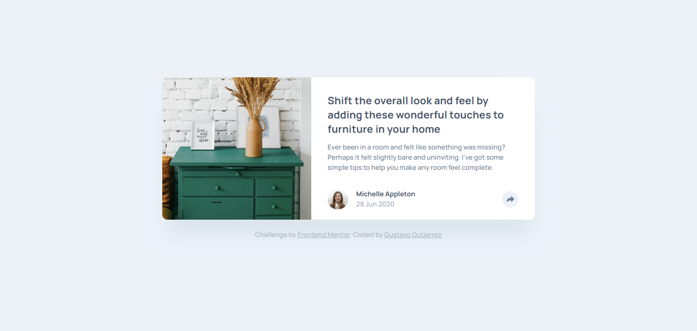

# Frontend Mentor - Article preview component solution

This is a solution to the [Article preview component challenge on Frontend Mentor](https://www.frontendmentor.io/challenges/article-preview-component-dYBN_pYFT). Frontend Mentor challenges help you improve your coding skills by building realistic projects.

## Table of contents

- [Overview](#overview)
  - [The challenge](#the-challenge)
  - [Screenshot](#screenshot)
  - [Links](#links)
- [My process](#my-process)
  - [Built with](#built-with)
  - [What I learned](#what-i-learned)
- [Author](#author)

## Overview

### The challenge

Users should be able to:

- View the optimal layout for the component depending on their device's screen size
- See the social media share links when they click the share icon

### Screenshot



### Links

- Solution URL: [Link to Solution](https://your-solution-url.com)
- Live Site URL: [Live Demo](https://gustavo2023.github.io/article-preview-component/)

## My process

### Built with

- Semantic HTML5 markup
- CSS custom properties
- Flexbox
- CSS Grid
- Mobile-first workflow
- JavaScript

### What I learned

- **Manipulating the DOM:** learned to select elements from the DOM using JavaScript. This way I can dynamically modify their behavior and properties.
- **Dynamic Behavior Based on Screen Size:** by using ```window.innerWidth``` I implemented functionality that dynamically adjusts based on the screen size.
- **Refactoring for Maintainability:** initially I used two separate buttons with distinct event listeners and functionality. While this worked, it introduced redundancy in both the HTML and JavaScript, making the code harder to maintain and extend. Later, I replaced the two buttons for a single button and dynamically adjusted its behavior based on the screen size. I created reusable functions (e.g., ```toggleTooltipDesktop``` and ```toggleSocialLinksMobile```) to improve modularity.

## Author

- Frontend Mentor - [@gustavo2023](https://www.frontendmentor.io/profile/gustavo2023)
